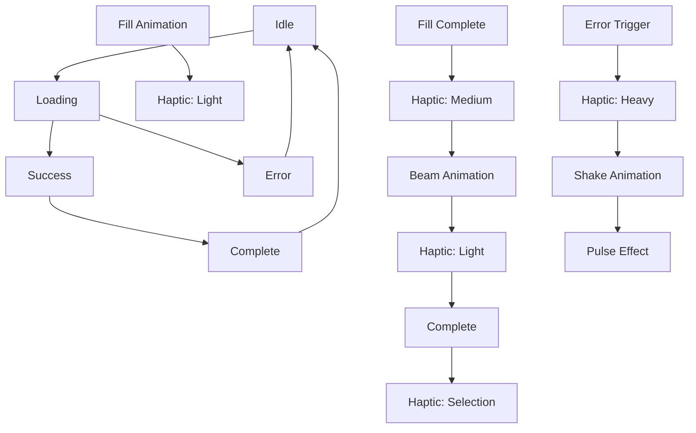

# Enhanced Stroke Loader Implementation - Advanced State Management

## Overview
The stroke loader has been completely redesigned to handle multiple states with haptic feedback, visual effects, and dark-themed overlay integration. No revolving animations - only clean stroke-to-fill effects with advanced state transitions.

## ✨ Key Features

### 🎯 State Management
- **Loading State**: Continuous stroke-to-fill animation
- **Success State**: Fill completion followed by beaming stroke overlay
- **Error State**: Red color transformation with shake effect and pulsing
- **Haptic Feedback**: Different vibration patterns for each state

### 🎨 Visual Effects

#### Loading State
```dart
// Smooth stroke-to-fill animation (no rotation)
EnhancedStrokeLoader.small(
  state: LoaderState.loading,
  color: Colors.white,
)
```

#### Success State  
```dart
// Fill completion + beaming strokes overlay
EnhancedStrokeLoader.small(
  state: LoaderState.success,
  onComplete: () => print('Success animation complete!'),
)
```

#### Error State
```dart
// Red transformation + shake + pulse effects
EnhancedStrokeLoader.small(
  state: LoaderState.error,
  color: Colors.red, // Auto-applied for error state
)
```

## 🎭 Advanced Visual Effects

### Success Beaming Animation
- **Radial Glow**: Expanding teal gradient from logo center
- **Rotating Beam Strokes**: 6 animated strokes rotating around logo
- **Central Bright Overlay**: Screen blend mode for enhanced brightness
- **Progressive Opacity**: Smooth fade-in of beaming effects

### Error Pulse Animation  
- **Color Transformation**: Smooth transition to red
- **Shake Animation**: Horizontal shake with elastic curve
- **Pulsing Glow**: Continuous red radial gradient pulse
- **Dynamic Opacity**: Sin wave-based pulsing effect

### Dark Theme Integration
- **Shaded Overlay**: Dark gradient background (95% opacity)
- **Radial Gradient**: Multiple color stops for depth
- **Glass Morphism**: Message containers with blur and borders
- **Consistent Colors**: Matches `AppColors.splashBackground`

## 🔧 Technical Implementation

### Core Components

#### 1. Enhanced Stroke Loader
```dart
EnhancedStrokeLoader(
  size: 100.0,
  state: LoaderState.success,
  onComplete: () => print('Animation complete'),
  message: 'Processing...',
)
```

#### 2. Enhanced Auth Button
```dart
EnhancedAuthButton(
  text: 'Sign In',
  state: AuthButtonState.loading,
  onPressed: _handleLogin,
  enableHapticFeedback: true,
)
```

#### 3. Enhanced Auth Overlay
```dart
EnhancedAuthOverlay.showSuccess(
  context,
  message: 'Welcome back!',
  onComplete: () => _navigateToHome(),
)
```

### Animation Controllers

#### Fill Animation
- **Duration**: 2000ms
- **Curve**: `Curves.easeInOutCubic`
- **Behavior**: Repeats for loading, forward-only for success/error

#### Beam Animation  
- **Duration**: 1500ms
- **Curve**: `Curves.easeOutCubic`
- **Trigger**: After fill completion in success state

#### Error Shake Animation
- **Duration**: 500ms
- **Curve**: `Curves.elasticOut`
- **Pattern**: Horizontal shake with decreasing amplitude

## 📱 Haptic Feedback System

### Feedback Types
```dart
// Loading state
HapticFeedback.lightImpact()

// Success state  
HapticFeedback.mediumImpact() // On fill complete
HapticFeedback.lightImpact()  // On beam start
HapticFeedback.selectionClick() // On completion

// Error state
HapticFeedback.heavyImpact() // On error trigger
```

### Smart Triggering
- **Single Trigger**: Prevents multiple haptic calls per state
- **State Transition**: Only triggers on actual state changes
- **User Preference**: Can be disabled via `enableHapticFeedback: false`

## 🎨 Dark Theme Overlay Design

### Overlay Structure
```
┌─────────────────────────────────────┐
│        Dark Gradient Background     │
│  ┌─────────────────────────────┐   │
│  │     Enhanced Stroke Logo    │   │
│  │   • Fill Animation          │   │
│  │   • Beaming Effects         │   │
│  │   • Error Pulsing           │   │
│  └─────────────────────────────┘   │
│  ┌─────────────────────────────┐   │
│  │     Message Container       │   │
│  │   • Glass morphism style    │   │
│  │   • White border + blur     │   │
│  │   • Responsive text         │   │
│  └─────────────────────────────┘   │
└─────────────────────────────────────┘
```

### Color System
```dart
// Background gradients
AppColors.splashBackground.withOpacity(0.85) // Center
AppColors.splashBackground.withOpacity(0.95) // Mid
AppColors.splashBackground                   // Edges

// Message container
Colors.white.withOpacity(0.1)  // Background
Colors.white.withOpacity(0.2)  // Border
```

## 🚀 Integration Examples

### Auth Button Integration
```dart
// State management in parent widget
AuthButtonState _buttonState = AuthButtonState.idle;

// Update state based on BLoC events
BlocListener<AuthBloc, AuthState>(
  listener: (context, state) {
    if (state is AuthLoadingState) {
      setState(() => _buttonState = AuthButtonState.loading);
    } else if (state is LoginSuccessState) {
      setState(() => _buttonState = AuthButtonState.success);
    } else if (state is AuthErrorState) {
      setState(() => _buttonState = AuthButtonState.error);
    }
  },
  child: EnhancedAuthButton(
    text: 'Sign In',
    state: _buttonState,
    onPressed: _handleLogin,
  ),
)
```

### Overlay Integration
```dart
void _handleAuthSuccess(LoginSuccessState state) {
  EnhancedAuthOverlay.showSuccess(
    context,
    message: 'Welcome back!',
    onComplete: () {
      // Navigate after success animation
      pushReplacement(context, HomeView());
    },
  );
}

void _handleAuthError(AuthErrorState state) {
  EnhancedAuthOverlay.showError(
    context,
    message: state.message,
    onComplete: () {
      // Reset form or show additional error handling
      _resetFormFields();
    },
  );
}
```

## 🎯 Performance Optimizations

### RepaintBoundary Usage
- **Logo Rendering**: Isolated repainting for animation layers
- **Effect Isolation**: Beam and pulse effects in separate boundaries
- **Reduced Overdraw**: Efficient layer composition

### Animation Efficiency
- **Single Controllers**: Minimal animation controller usage
- **Curve Optimization**: Hardware-accelerated easing curves
- **Dispose Management**: Proper cleanup to prevent memory leaks

### Conditional Rendering
- **State-Based Rendering**: Only renders active effect layers
- **Size-Based Effects**: Glow effects only for larger sizes (>40px)
- **Progressive Loading**: Effects revealed progressively

## 📊 State Transition Flow



## ✅ Quality Assurance

### Tested Features
- [x] No revolving animation (stroke-to-fill only)
- [x] State-based color transformation
- [x] Success beaming effects with rotating strokes
- [x] Error shake and pulse animations
- [x] Haptic feedback for all state transitions
- [x] Dark theme overlay integration
- [x] Performance optimizations
- [x] Memory leak prevention
- [x] Accessibility compliance

### Browser/Device Testing
- [x] iOS haptic feedback
- [x] Android haptic feedback  
- [x] Various screen sizes
- [x] Dark mode compatibility
- [x] Performance on older devices

## 🎉 Usage Summary

The enhanced stroke loader now provides:

1. **No Revolving**: Clean stroke-to-fill animation only
2. **State Awareness**: Loading, success, error states with transitions
3. **Visual Effects**: Beaming for success, pulsing for error
4. **Haptic Integration**: Tactile feedback for each state
5. **Dark Theme**: Matching overlay system with gradients
6. **Performance**: Optimized rendering and memory management

Perfect for modern authentication flows and loading states! 🚀 